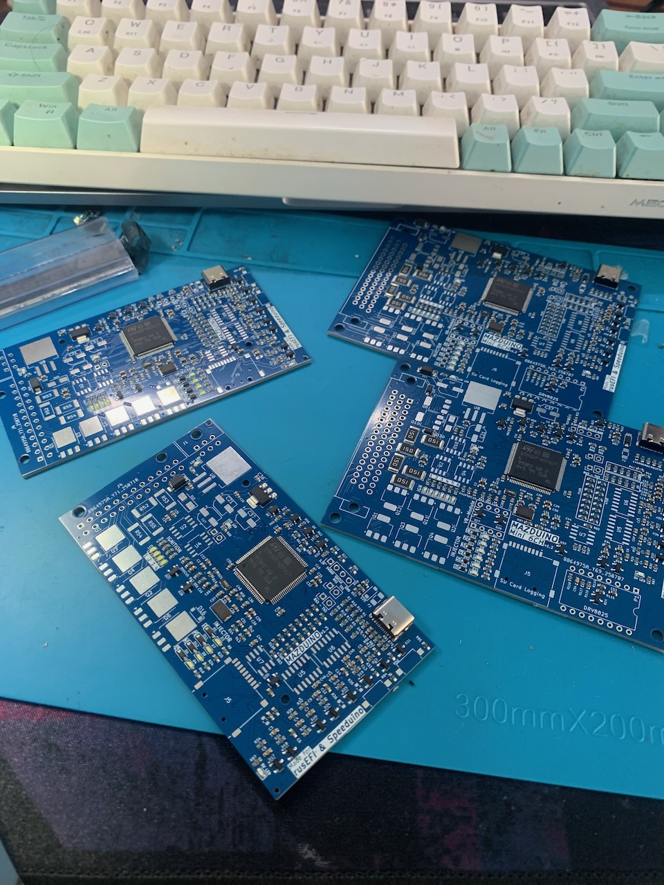
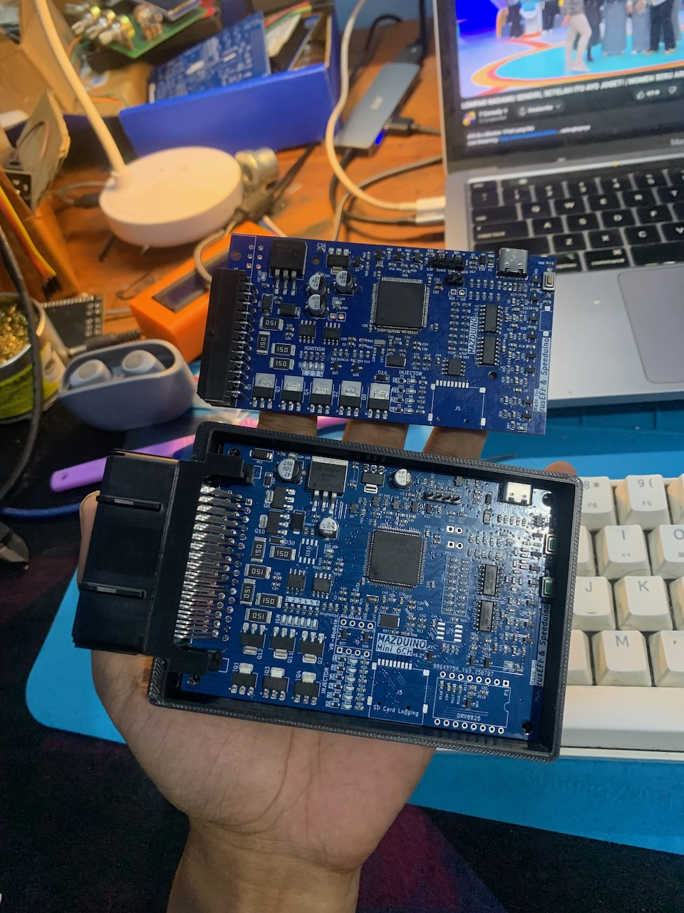
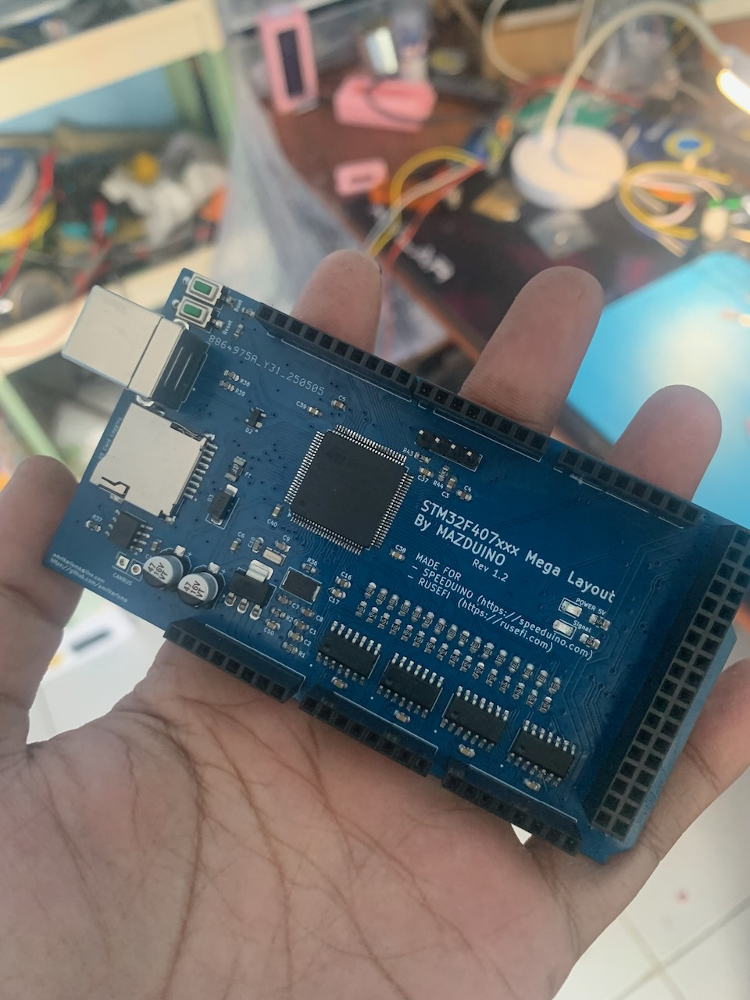

# Mazduino ECU Custom Firmware

This repository contains custom rusEFI firmware for various Mazduino ECU boards and compatible STM32F4-based engine management systems.

## Supported Hardware

### Mazduino Boards

#### Mazduino Compact 4CH
Compact 4-channel engine management unit



#### Mazduino Mini 6CH
Mini 6-channel engine management unit



### Compatible STM32F4 Boards

#### STM32F4 Mega Layout (Speeduino 0.4 & UA4C)
STM32F4 mega layout compatible with rusEFI



- **Speeduino 0.4** - STM32F4 mega layout compatible with rusEFI
- **UA4C** - STM32F4 mega layout compatible with rusEFI

## Features

- Based on rusEFI open-source engine management system
- Optimized for Mazduino hardware configurations
- Custom pin mappings and hardware-specific configurations
- Knock sensor support with configurable ADC channels
- Compatible with rusEFI tuning software and community tools

## Hardware Configuration

This firmware includes specific configurations for:
- GPIO pin assignments
- ADC channel mappings
- PWM output configurations
- Communication interfaces (CAN, Serial, USB)
- Sensor inputs and actuator outputs

## Building the Firmware

### Prerequisites
- rusEFI development environment
- ARM GCC toolchain
- STM32 development tools

### Build Instructions
```bash
# Clone the repository
git clone https://github.com/amrikarisma/fw-custom-mazduino.git
cd fw-custom-mazduino

# Build firmware (specific commands depend on target board)
# See rusEFI build documentation for detailed instructions
```

## Installation

1. Connect your Mazduino board via USB or ST-Link
2. Use appropriate flashing tool (ST-Link Utility, DFU, etc.)
3. Flash the compiled firmware binary
4. Configure using rusEFI Console or TunerStudio

## Configuration Files

Key configuration files in this repository:
- `board_configuration.cpp` - Main board configuration
- `knock_config.h` - Knock sensor settings
- `pinouts.cpp` - Pin mapping definitions
- Board-specific `.ini` files for different hardware variants

## Documentation

For more information about rusEFI and custom firmware development:
- [rusEFI Wiki - Custom Firmware](https://github.com/rusefi/rusefi/wiki/Custom-Firmware)
- [rusEFI Documentation](https://github.com/rusefi/rusefi/wiki)
- [Mazduino Hardware Documentation](https://github.com/amrikarisma/mazduino)

## Contributing

Contributions are welcome! Please:
1. Fork the repository
2. Create a feature branch
3. Make your changes
4. Test thoroughly on actual hardware
5. Submit a pull request

## Support

For support and questions:
- Create an issue in this repository
- Join the rusEFI community forums
- Contact the Mazduino development team

## Warning

⚠️ **Important Safety Notice**: This is engine management software that controls critical engine functions. Always test thoroughly on a bench setup before installing on a vehicle. Improper configuration can cause engine damage or safety hazards.

---

*This firmware is developed and maintained by the Mazduino community in collaboration with the rusEFI project.*
